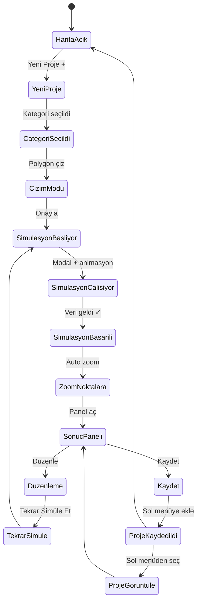

## 7. Durum Diyagramı (Mermaid)

Aşağıdaki diyagram, gereksinim notlarındaki akışa göre hazırlanmıştır. fileciteturn1file0

```mermaid
stateDiagram-v2
    [*] --> HaritaAcik
    HaritaAcik --> YeniProje: Yeni Proje +
    YeniProje --> CategoriSecildi: Kategori seçildi
    CategoriSecildi --> CizimModu: Polygon çiz
    CizimModu --> SimulasyonBasliyor: Onayla
    SimulasyonBasliyor --> SimulasyonCalisiyor: Modal + animasyon
    SimulasyonCalisiyor --> SimulasyonBasarili: Veri geldi ✓
    SimulasyonBasarili --> ZoomNoktalara: Auto zoom
    ZoomNoktalara --> SonucPaneli: Panel aç
    SonucPaneli --> Duzenleme: Düzenle
    Duzenleme --> TekrarSimule: Tekrar Simüle Et
    TekrarSimule --> SimulasyonBasliyor
    SonucPaneli --> Kaydet: Kaydet
    Kaydet --> ProjeKaydedildi: Sol menüye ekle
    ProjeKaydedildi --> HaritaAcik
    ProjeKaydedildi --> ProjeGoruntule: Sol menüden seç
    ProjeGoruntule --> SonucPaneli
```
